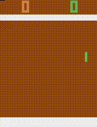
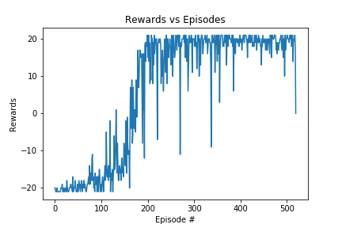

# Reinforcement Learning - Deep-Q Network
* Implementing Deep Q-Learning agent to play Pong.
* Refer to the following in order to understand the implementation:
  * [Human Level Control through Deep RL](https://deepmind.com/research/publications/human-level-control-through-deep-reinforcement-learning)
  * [Playing Atari with Deep Reinforcement Learning](https://arxiv.org/abs/1312.5602)

Here is the final agent, which seems to lose the first point in order to put the other agent in worse position:

As shown by the graph below, the agent starts very slowly with a reward of -20 and eventually gets reasonably consistent rewards of 20:

